# Hauk-Morten Lykke

**`Product developer/Mechanical engineer`**

About myself: To be updated.

## Engineering projects

  

    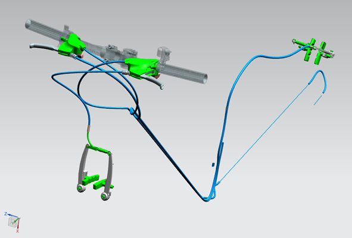
    

      3D-rendering of the braking system of a bicycle. Designed and visualized in Siemens NX. We found a user group, investigated their needs, and finally designed and built a bicycle around these needs.
    

  

  

    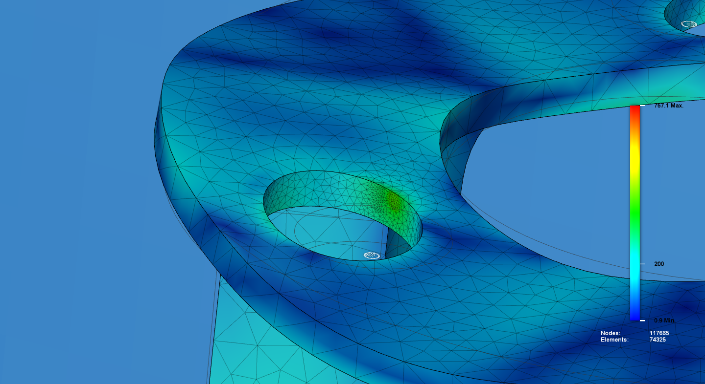
    

      Finite Element Method (FEM) analysis of a machine part. Where are the tensions highest?
    

  

  
  

    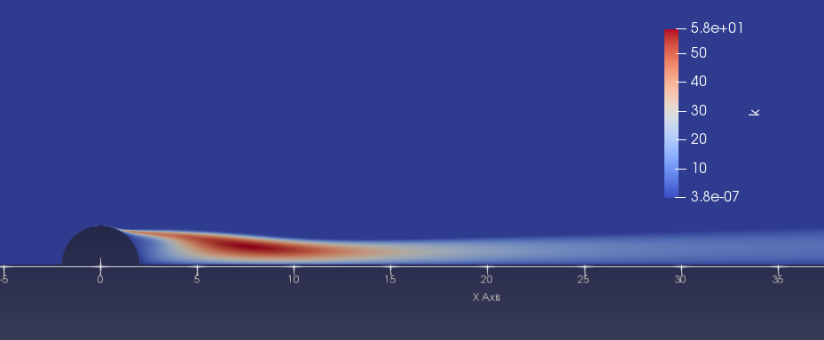
    

      Computational Fluid Dynamics (CFD) simulation showing airflow over a half-cylinder.
    

  

  

    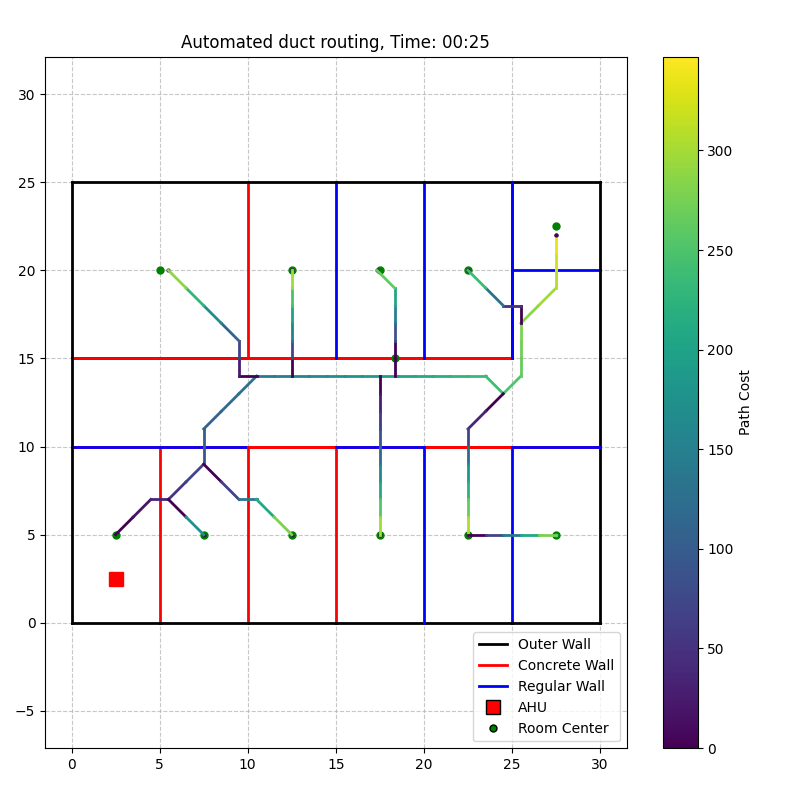
    

      Why are we still drawing out every single ventilation duct manually if we could be doing this algorithmically by code? Check out my work at GitHub under the Artery repository.
    

  

  

    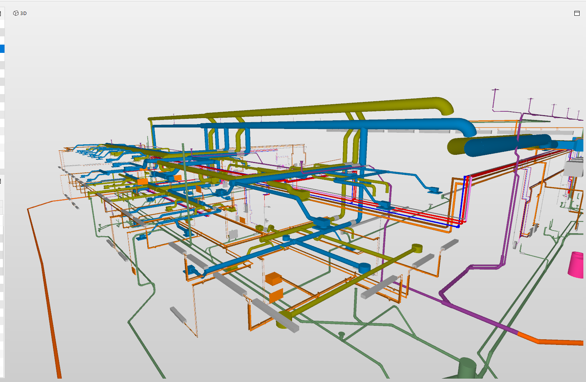
    

      If you have never worked with a building project, you'd be surprised how much space the ventilation takes!
    

  

## Product design

  

    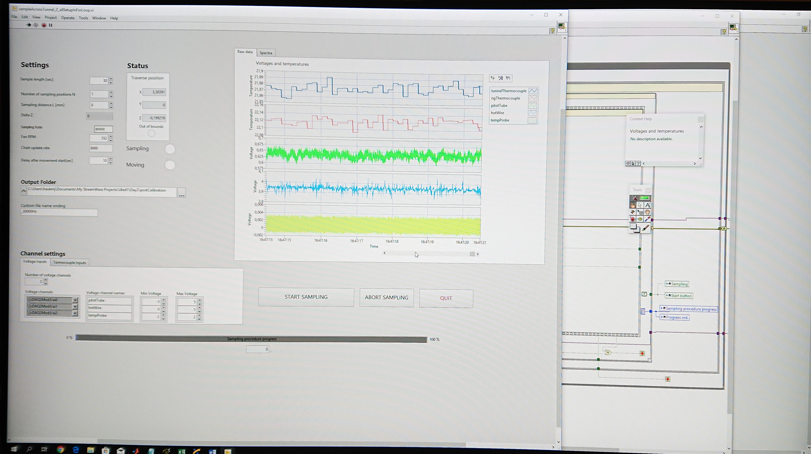
    

      LabVIEW interface used for data acquisition in my master thesis. Aesthetics wasn't a priority, this is purely functional. What am I logging from the wind tunnel here?
    

  

  

    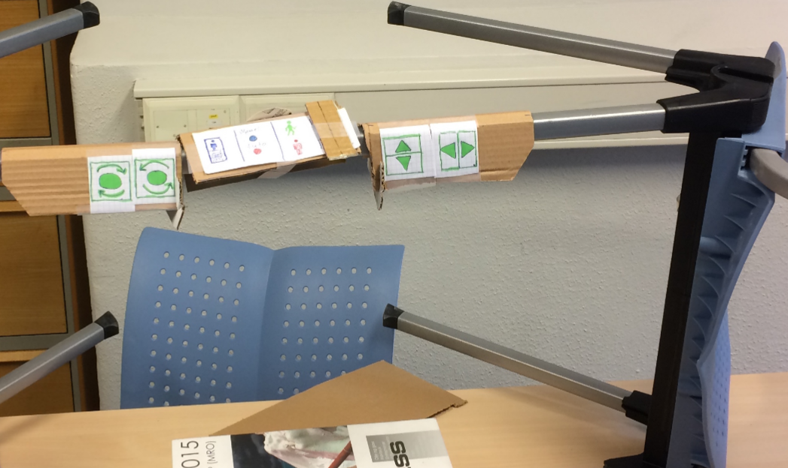
    

      A student project in which we were developing an autonomous hospital bed. The bed would be manned by a nurse or portier when containing a patient, and then be driving autonomously around when being moved between patients. When controlled manually, the interface would need to be intuitive. We found out the buttons were not ergonomically placed in the first attempt, so in this prototype we have already rearranged all buttons and functions three times in 15 minutes, pretending to be rolling around with a patient.
    

  

## Art and design projects

  

    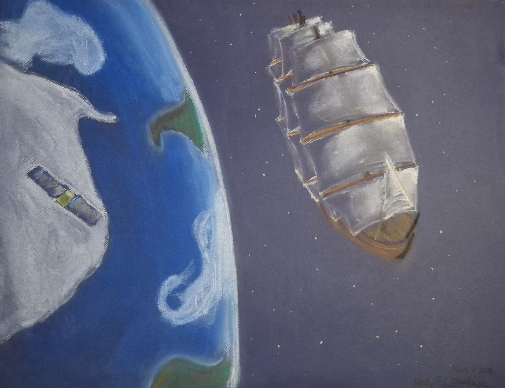
    

      A conceptual drawing of a spaceship. Pastel colors.
    

  

  

    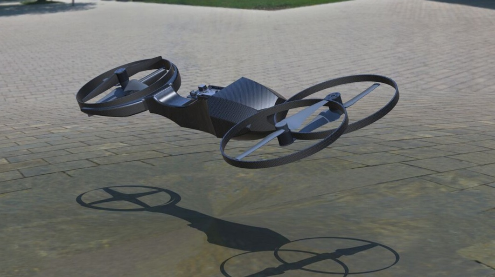
    

      A hoverbike. I and a friend applied to Red Bull for funding to build this as a hobby project. This is before we calculated anything, it's all freehand modeling.
    

  

  

    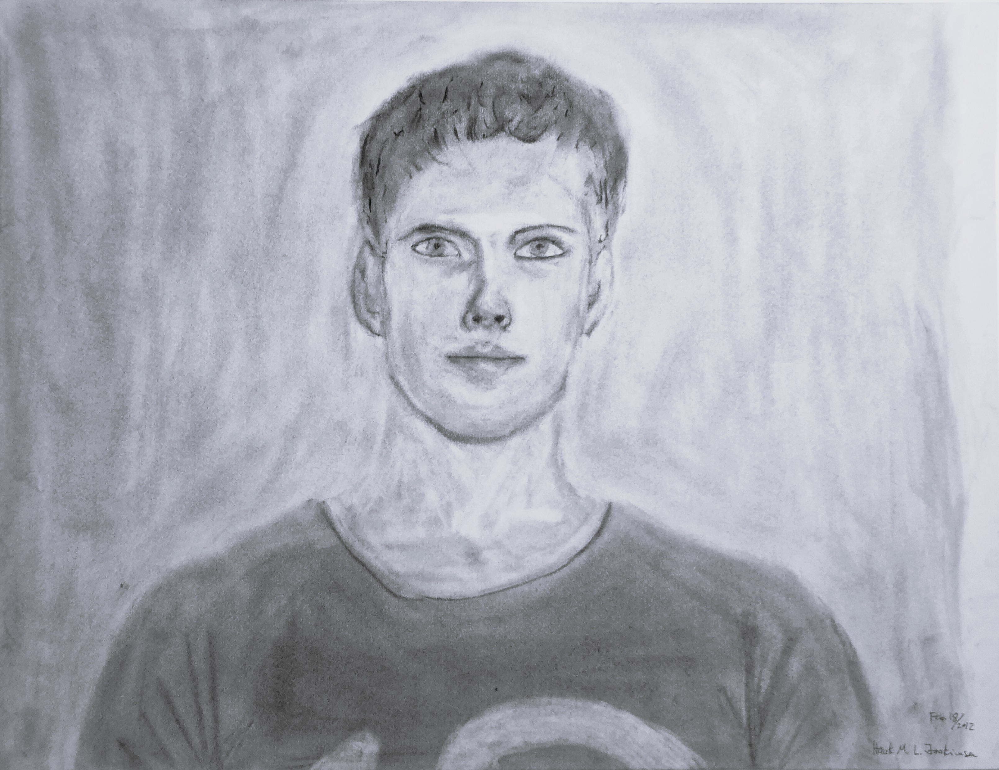
    

      A self-portrait from my art studies. Coal on paper.
    

  

  

    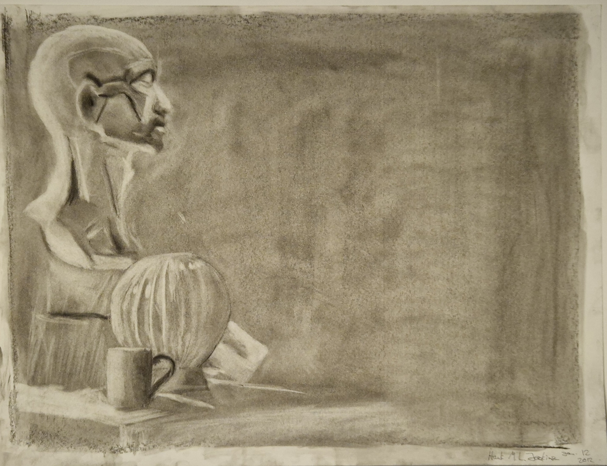
    

      A black-and-white sketch of various items. Coal on paper. The sheet was first covered in coal, the actual drawing was done by eraser, drawing the light.
    

  

### 🧰 Programming languages

  

    
    
C#

  

  

    
    
Python

  

  

    
    
C++

  

  

    
    
Git

  

  

    
    
HTML

  

  

    
    
CSS

  

  

    
    
JavaScript

  

 

### Engineering tools

  

    
    
Revit

  

  

    
More apps coming...

  

