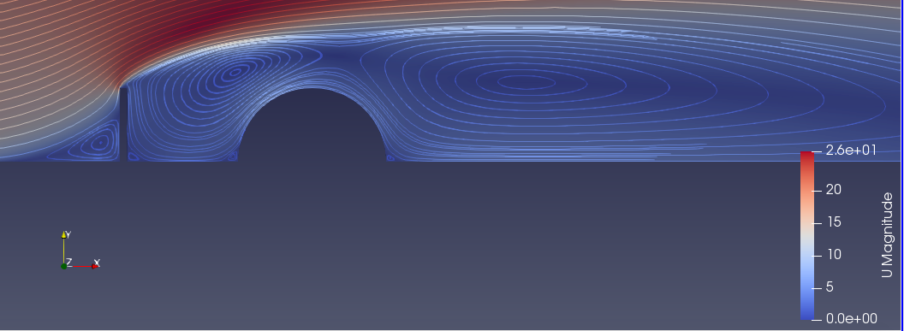

# Hauk-Morten Lykke

**`Sivilingeniør/Produktutvikler`**

Tekst om meg selv.
---

## Ingeniørprosjekter

	
	
	
	

## Kunstprosjekter

I tillegg til ingeniørutdannelsen har jeg studert kunst ved Seattle Central Community College. Her er noen eksempler fra mitt arbeid der.

	
	
	

### 🧰 Programmeringsspråk

 

 

### Ingeniørverktøy

 

#
<!--

 
<h3>Utfyllende om meg selv</h3>

   Her kan det stå tekst som kan utviders.

   
<!--
**Hauk-Lykke/Hauk-Lykke** is a ✨ _special_ ✨ repository because its `README.md` (this file) appears on your GitHub profile.

Here are some ideas to get you started:

- 🔭 I’m currently working on ...
- 🌱 I’m currently learning ...
- 👯 I’m looking to collaborate on ...
- 🤔 I’m looking for help with ...
- 💬 Ask me about ...
- 📫 How to reach me: ...
- 😄 Pronouns: ...
- ⚡ Fun fact: ...
-->

-->
