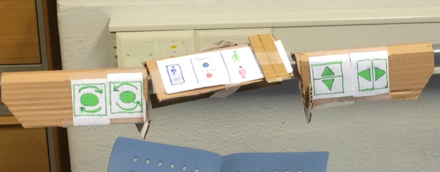

# Hauk-Morten Lykke

**`Product developer/Mechanical engineer`**

About myself: To be updated.

## Art and design projects

  

    
    

      A conceptual drawing of a "spaceship". The drawing was part of a student project where we trained on using colored large format paper with pastel colors(american equivalent to A0 perhaps?). I made a series of four pictures themed by misplaces crafts/vehicles, in this case an old fashioned sailing ship in space.
    

  

  

    
    

      A hoverbike. I and a friend applied to Red Bull for funding to build this as a hobby project. This is before we calculated anything, it's all freehand modeling.
    

  

  

    
    

      A self-portrait from my art studies. Coal on paper.
    

  

  

    
    

      A black-and-white sketch of various items. Coal on paper. The sheet was first covered in coal, the actual drawing was done by eraser, drawing the light.
    

  

## Engineering projects

  

    
    

      3D-rendering of the braking system of a bicycle. Designed and visualized in Siemens NX. We found a user group, investigated their needs, and finally designed and built a bicycle around these needs.
    

  

  

    
    

      Finite Element Method (FEM) analysis of a machine part. Where are the tensions highest?
    

  

  
  

    
    

      Computational Fluid Dynamics (CFD) simulation showing airflow over a half-cylinder.
    

  

 

    
    

      Why are we still drawing out every single ventilation duct manually if we could be doing this algorithmically by code? Check out my work at GitHub under the <a href="https://github.com/COWI-A-S/Artery">Artery repository</a>().
    

  

  

    
    

      If you have never worked with a building project, you'd be surprised how much space the ventilation takes! In this image, I designed most of the ventilation (blue and yellow ducts) and the sanitary plumbing (green).
    

  

## Product design

  

    
    

      LabVIEW interface used for data acquisition in my master thesis. Unfortunately LabVIEW doesn't allow for much customization with respect to aestetics in the design, this is purely functional. What am I logging from the wind tunnel here?
    

  

  

    
    

      A student project in which we were developing an autonomous hospital bed. The bed would be manned by a nurse or portier when containing a patient, and then be driving autonomously around when being moved between patients. When controlled manually, the interface would need to be intuitive because time is very limited for the nurses. 
      This might look silly to the untrained eye, but we learned at least five lessons from this. For example, the turning buttons and the forward button were not possible to operate simultaneously when moving the bed in an ergonomical way in the first attempt, so in this prototype we have already rearranged all buttons and and added functions three times in 15 minutes, pretending to be rolling around with a patient. Moving around a bed like this might look fun for a child, the need for an ID-card reader or some other form of restriction was quickly uncovered.
    

  

### 🧰 Programming languages

(If these aren't in a neat row, it's because this list was created after 1 am in the night. Short deadline..)
 

### Engineering tools

  

    
    
Revit

  

  

    
More apps coming...

  

